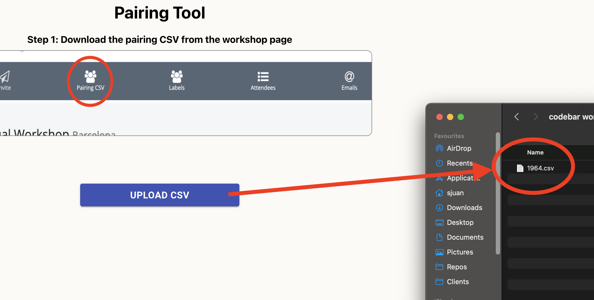
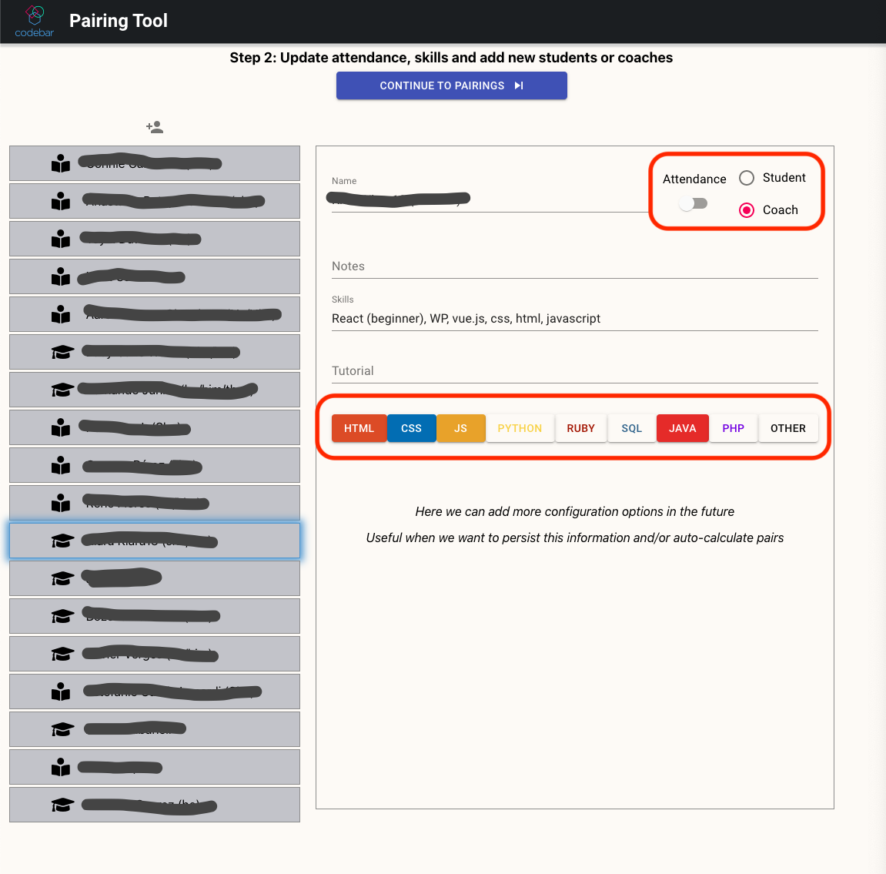
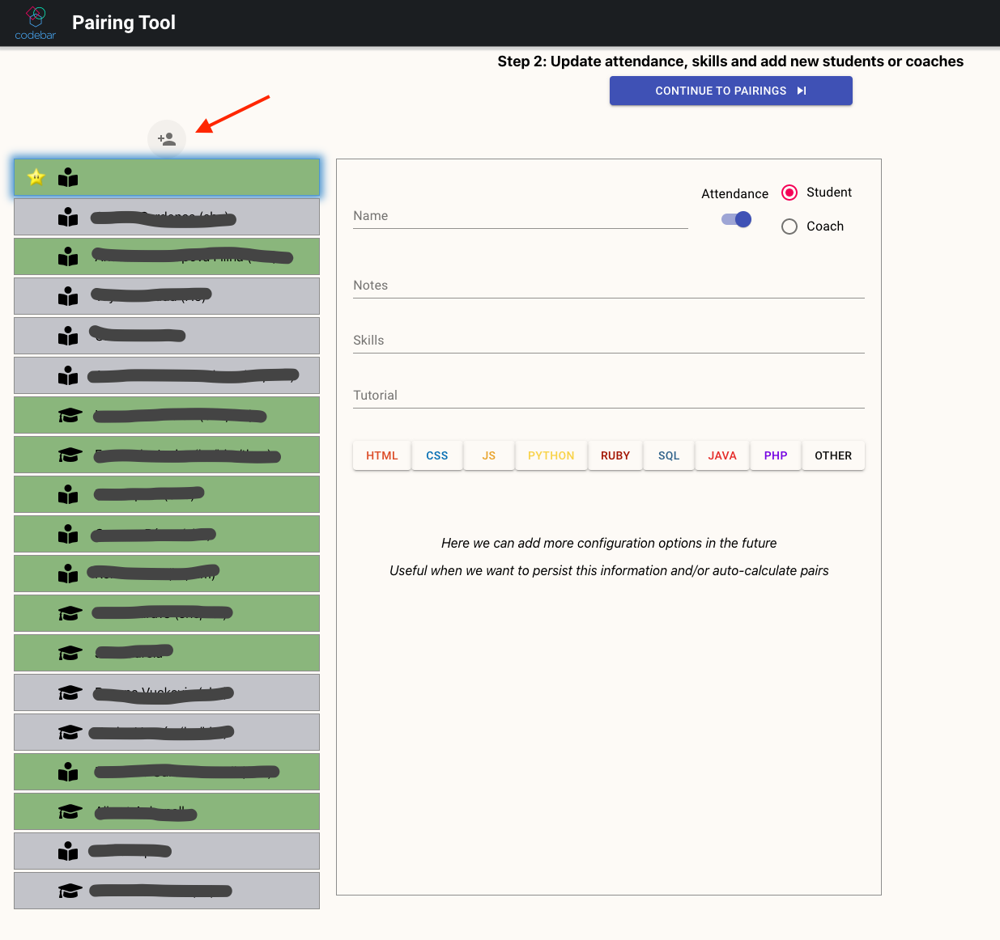
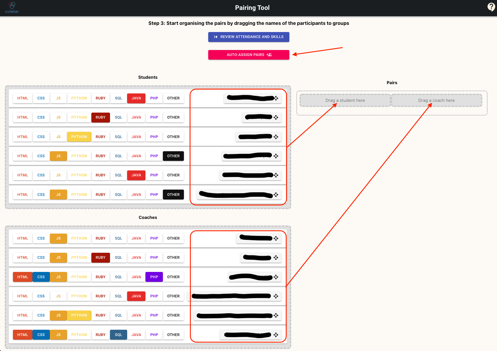
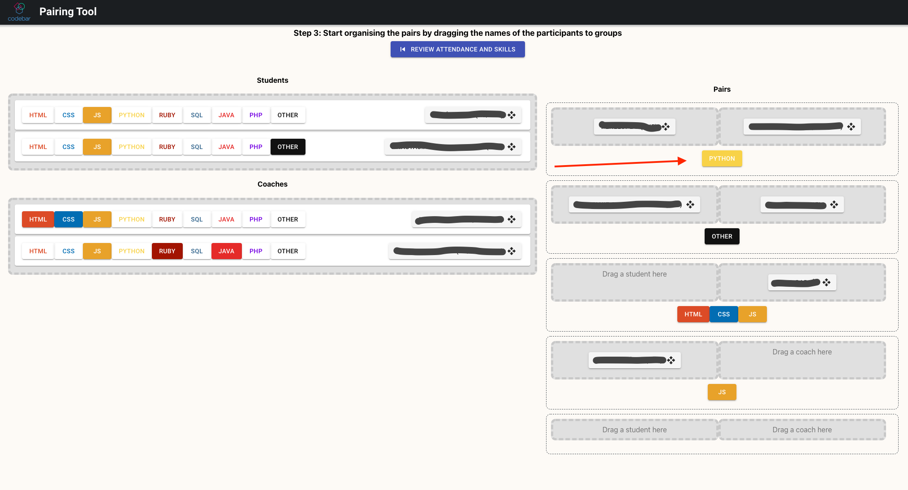

# User Manual

This is a [first prototype of the pairing tool](https://saljuama.github.io/codebar-pairing-tool/) and is meant to help doing the pairing during the workshops.

## Limitations

> :warning: REMEMBER: This is still a prototype, and some features are limited or have oversimplified implementations, when using it, keep in mind:

* It does not store any state, refreshing the browser will reset everything
* The autodetect skills/languages feature, works based on parsing the notes/tutorial/skills that participants added in their profiles at [codebar.io](codebar.io), but the detection is not 100% accurate. Specially between Java and Javascript, and also Other technologies.
* In the pairings screen, skills are not editable, this is to avoid accidental changes since this screen works using drag and drop
* Going back from the pairings to the attendees list, will reset all the existing pairings.

## How to use it

### 1. Download the workshop CSV file and load it into the pairing tool

You can download the CSV from the specific workshop from the admin section of the Codebar website:
* [Barcelona Workshops](https://codebar.io/admin/chapters/15/workshops)

And upload the CSV file, when clicking the button select the file in your file system.

### 2. Update attendance and skills for each participant

Recommended to do this during the round of presentations at the beginning of the workshop. For each participant:

* Check the attendance
* Update the skills if there is any that is not correct or missing
* Update the role if needed, as sometimes due to many students or coaches there are role swaps.

In case there is any participant who didn't sign up for the workshop (happens mostly with some coaches), you can add a new person and fill their details.

Once all the attendees are reviewed and updated, click on the `Continue to Pairings` button at the top of the screen.

### 3. Sort the pairings

Start dragging and dropping students and coaches into the respective destination boxes.

When you drag and drop a person, in the pair box will be displayed the skills that everyone in that pair have in common.

Also a new pair box will appear to form more pairs.

It is possible to drag more than 1 student/coach in a pair, so it is possible to have triples and give 2 students to a coach or pair 2 coaches with 1 student.

### 4. Well done, now announce the pairs!!!