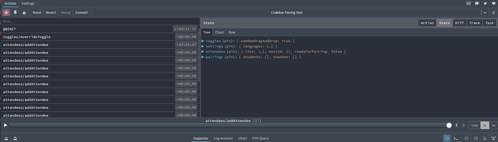

# Redux

## Motivation

Was it necessary to use Redux to develop this tool? No

Why use it then? The pairing tool, from the user point of view, is quite interactive, and leveraging those interactions
plus the metadata associated to these actions, while possible to implement without Redux, it would highly increase the 
state management across different components of the application. Therefore, the author decided that the benefits this 
tool bring outweighs the cost and complexity of adding a new tool.  

### Libraries 

- [Redux](https://redux.js.org/) The official redux, a state container for JS applications
- [Redux Toolkit](https://redux-toolkit.js.org/) is an official and opinionated toolkit to reduce the necessary boilerplate
- [React-Redux](https://react-redux.js.org/) provide easy integration and hooks that can be used in React components

### Learning Resources

If you are completely new to the Redux and the use of the flux pattern, then it is recommended to get familiar with it.
Some recommended resources for it:
- Video tutorial: [Fundamentals of Redux Course from Dan Abramov](https://egghead.io/courses/fundamentals-of-redux-course-from-dan-abramov-bd5cc867). 
Does not include information about Redux Toolkit or React-Redux
- [Redux official documentation](https://redux.js.org/introduction/getting-started) 

### Browser extension

Available in different browsers, this extension is very helpful to visualize and troubleshoot the behaviour of the application



It helps to visualize the actions that are dispatched, the state of the application after each of the actions, etc.

## Pairing Tool Redux Store

On the high level overview, the store for this application has been designed with 4 main sections or slices. 

```javascript
{
  toggles: { ... },
  settings: { ... },
  attendees: { ... },
  pairings: { ... }
}
```

### Toggles 

This slice is purely to manage the feature toggle infrastructure, more information on the [Feature Toggles]() documentation

### Settings

This slice is meant to control anything from the application that can be configurable. Currently, there is no UI for it,
so the application is not really configurable... yet. 

Elements that are handled in the settings:
- Languages and technologies, as well as some aliases and exclusion words used to parse the workshop CSV
- Thats it, no more elements for now

### Attendees

This slice handles everything related to who is attending the workshop, and what roles and languages/technologies are 
they interested in. It is mostly used in steps 1 and 2, when parsing the CSV, and when updating the details of the 
attendees. 

### Pairings

This slice handles the action in the Step 3 of the application, and the state of the application whenever there is a 
change in the pairs after dragging and dropping attendees from/to different groups.
