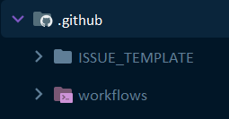
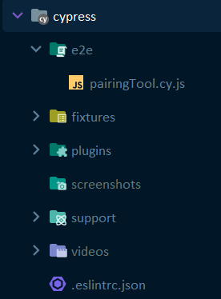
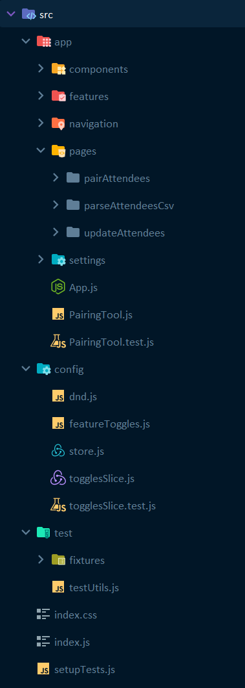

# Repository and code organization

The code in the repository is organized in different folders, each of them having different purposes:

## .github

This folder contains code associated to different integrations with GitHub

 - `workflows` folder contains the pipeline as code, based on GitHub Actions. 
It will be triggered every time we push changes to the `main` branch.
You can see the builds at https://github.com/codebar/pairing-tool/actions

 - `ISSUE_TEMPLATE` folder, contains templates to create GitHub issues associated to this repository.
They are available at https://github.com/codebar/pairing-tool/issues/new/choose

## cypress

This folder contains everything related to functional tests

- `e2e` folder contains the actual functional or end to end tests
- `fixtures` folder contains some test data to be used within the tests
- All other folders ar either for configuration or for generated outputs after tests executions

## doc

This folder contains all the documentation for this project, including: 

- `user-manual` this is the explanation of the Pairing Tool from the user perspective
- `maintainers` this folder contains information providing context about the application, its architecture, 
and some development guidelines

## public

This folder contains public assets for the web application

## src

This folder contains all the source code of the pairing tool web application

- `app` contains different elements of the application, such as pages, shared components, etc.
- `config` contains general configuration for the frameworks used in the application, and for feature toggles
- `test` contains some tests fixtures and some utilities to write tests more easily
