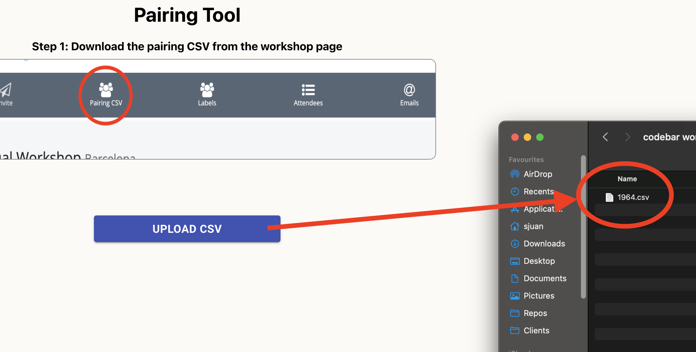
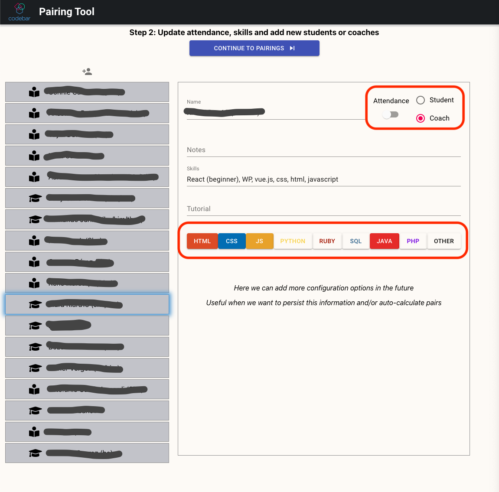
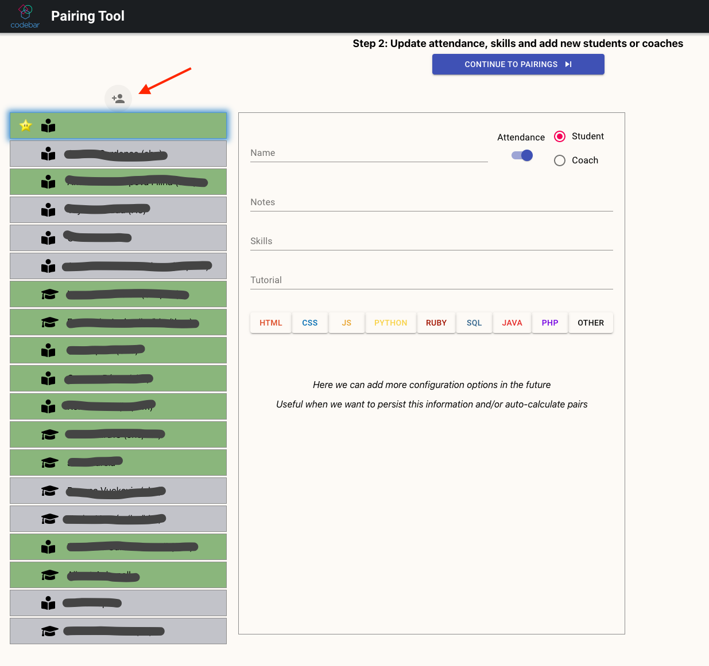
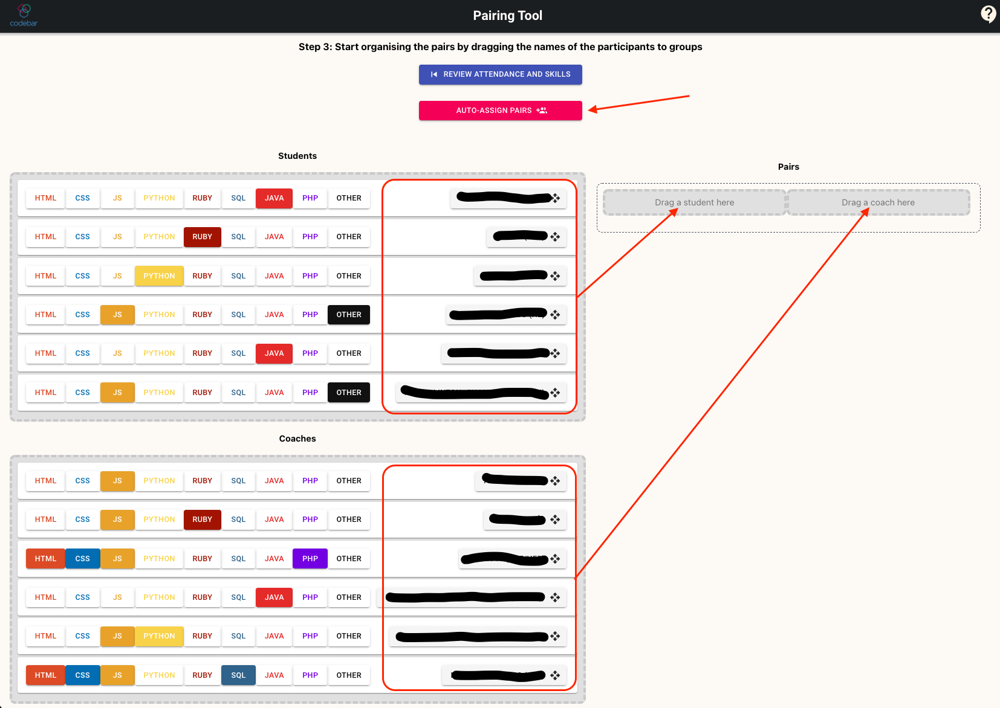
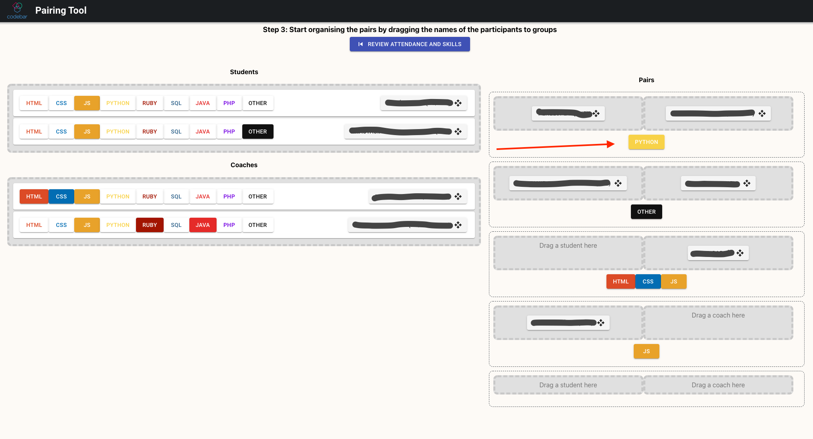

# User Manual

This is a [first prototype of the pairing tool](https://codebar.github.io/pairing-tool) and is meant to help with the pairing during the workshops.

## Limitations

> :warning: REMEMBER: This is still a prototype, and some features are limited or have oversimplified implementations, when using it, keep in mind:

* It does not store any state, refreshing the browser will reset everything
* The autodetect skills/languages feature, works based on parsing the notes/tutorial/skills that participants added in their profiles at [codebar.io](codebar.io), but the detection might not 100% accurate, and not everyone fills these fields in their profiles, you'll need to double check.
* In the pairings screen, skills are not editable, this is intended, to avoid accidental changes since this screen works using drag and drop
* Going back from the pairings to the attendees list, will reset all the existing pairings.

## How to use it

### 1. Download the workshop CSV file and load it into the pairing tool

You can download the CSV from the specific workshop from the admin section of the Codebar website:
* [Barcelona Workshops](https://codebar.io/admin/chapters/15/workshops)

And upload the CSV file, when clicking the button select the file in your file system.

### 2. Update attendance and skills for each participant

Recommendation: Do this during the round of presentations at the beginning of the workshop. For each participant:

* Check the attendance
* Update the skills if there is any that is not correct or missing
* Update the role if needed, as sometimes due to many students or coaches there are role swaps.

In case there is any participant who didn't sign up for the workshop (happens mostly with some coaches), you can add a new person and fill their details.

Once all the attendees are reviewed and updated, click on the `Continue to Pairings` button at the top of the screen.

### 3. Sort the pairings

To sort the pairs, there are 2 available features: 

* You can drag and drop students and coaches to specific pair slots
* You can click the "Auto-Assign Pairs" buttons

#### Drag and Drop participants

You can drag and drop participants by their name: 
* From the list of available participants to a pair group
* From a pair group to another pair group
* From a pair group back to the list of available participants

When you drag and drop a person to a pair group: 
* The list of all languages in common to everyone in the group will be displayed, and refreshed whenever the group changes.
* A new box for a new pair will appear if you used the only empty group.

It is possible to drag more than 1 student/coach in a group, in case you want to build a bigger group.

#### Auto-Assign Pairs

> :warning: NOTE: Finding Pairs auto-magically is a complex problem, and we are all human, there are some aspects that
are hard to take into account for different algorithms, or it would be so expensive to do so.

When clicking this button, the pairing tool will try to:
* Find the maximum amount of pairs possible
* Only find 1:1 pairs, it will not assign 2 students to 1 coach
* It might not find a pair for everyone.
* It will NOT modify existing pairs, so you can pre-pair people before using the button
* It will NOT try to fill half-pairs (where only a student, or a coach is placed in a pair group)

Also, you will still be able to move people around and change the generated pairs after clicking the button.

Or even, if you do undo some pairs by dragging the people back to the list of available students and/or, and then click again, it will try to find pairs again.

### 4. Well done, now announce the pairs!!!
